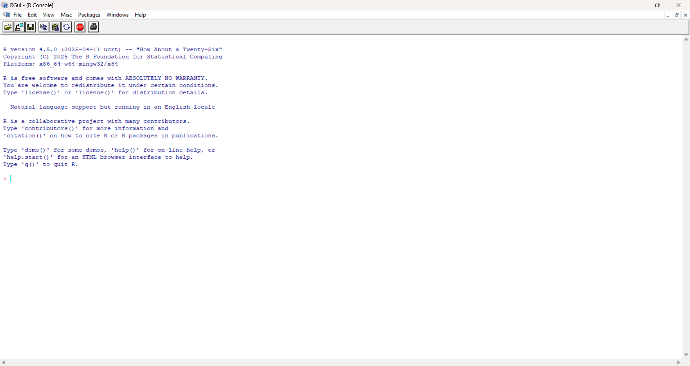

# Why R and what is RStudio?

## Why R for scientific research?

> Shorten this ...

R has become a cornerstone of scientific research due to its powerful statistical capabilities, open-source nature, seamless integration diverse data sources and types, and focus on reproducibility. It is a programming language built for statistical computing and graphics, offering a vast ecosystem of packages tailored to researchers' needs. This means you will find tools for everything from basic data manipulation to advanced machine learning across virtually all scientific disciplines. The open-source model fosters a vibrant community that constantly contributes to CRAN (the Comprehensive R Archive Network), a network of web servers around the world that store identical, up-to-date, versions of code and documentation for R, ensuring R stays at the forefront of statistical innovation.

R also excels at producing high-quality, publication-ready graphics. Its powerful plotting capabilities allow researchers to create insightful and customizable visualizations, crucial for effectively communicating findings. Crucially, R-based workflows promote reproducibility. By writing scripts, researchers can meticulously document every step, ensuring their work can be easily replicated and validated — a fundamental aspect of the scientific method. This combination of robust statistical tools, a thriving community, excellent graphics, and a focus on reproducibility makes R an indispensable tool for modern scientific inquiry.

While incredibly powerful, R does have some limitations. The initial learning curve can be steeper than with point-and-click software, as it requires understanding programming concepts. The extensive package ecosystem, while a strength, can also be overwhelming for new users. Additionally, the quality and maintenance of community-developed packages can vary. Finally, for extremely large datasets or computationally intensive tasks, R's performance, while improving, might sometimes lag behind more optimized languages.

```{r, echo= FALSE, fig-cap= "A screenshot of R"}

```

## What is RStudio and role does it play?

While you can interact with R through it's basic command-line interface, scientific researchers will find RStudio to be an invaluable tool to work with R. Think of R as the engine under the hood, doing all the computational work. RStudio, on the other hand, is a user-friendly integrated development environment (IDE) that provides a more organized and efficient way to interact with R.

RStudio enhances your workflow by offering a suite of features tailored for R users. It typically includes a code editor with syntax highlighting and autocompletion, a console where you execute R commands and see the output, a workspace pane to track your data and variables, a history of your commands, and tools for plotting, package management, and debugging. Essentially, RStudio provides a well-structured environment that makes writing code, managing projects, and analyzing data in R much more intuitive and productive for scientific research.

```{r, echo=F, fig.cap="A screenshot of RStudio"}
knitr::include_graphics("images/rstudio-screenshot.png")
```

## git

TODO

## Online git e.g. GitHub

TODO
