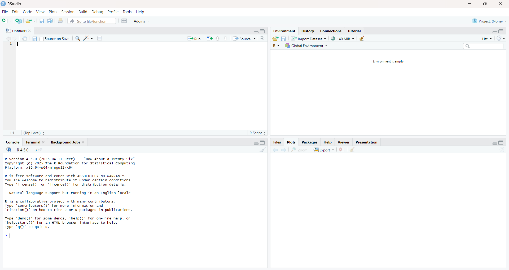
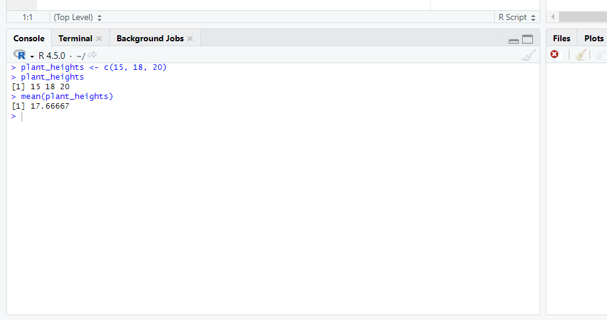
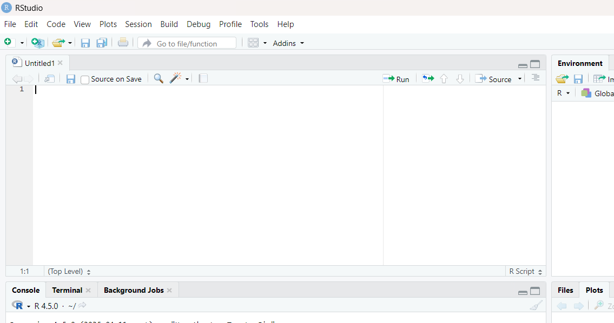
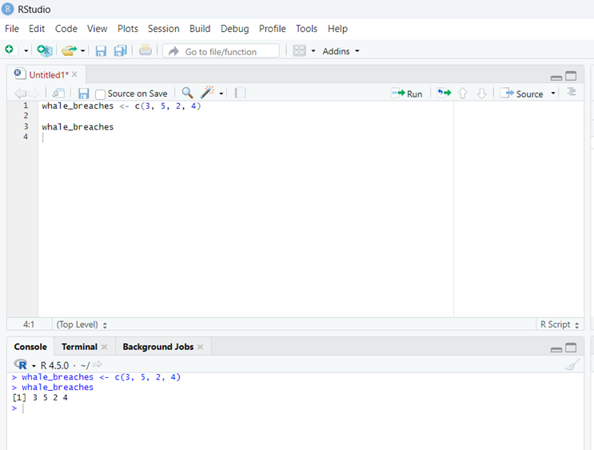
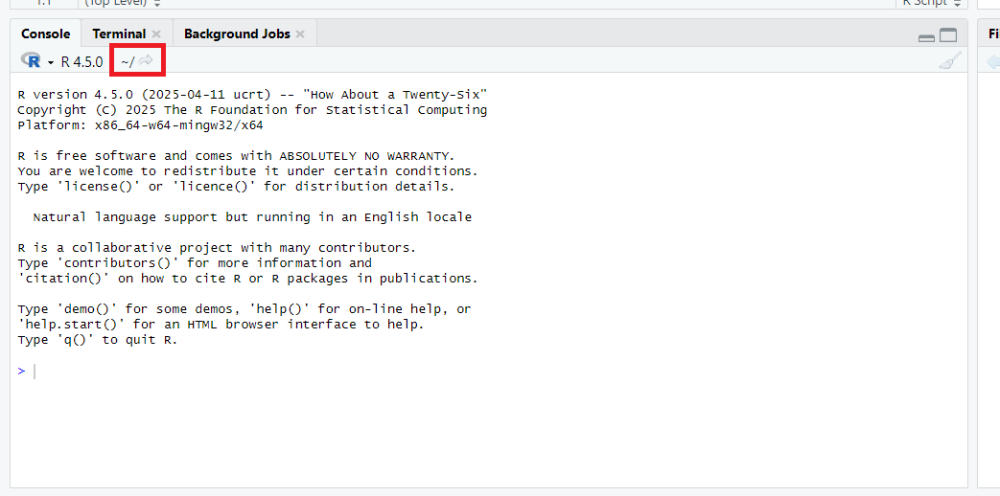

# Initial steps

Here we describe some things ...

Do we ask the user to follow something concrete here? First code, first script, create project (? the course project for following examples?), installing necessary packages, setup RStudio not to save

## Navigating the RStudio interface

After installing R, RStudio and git (see prereqs) and opening RStudio for the first time, you will be presented with an interface containing four primary panels.

- The **Source** panel (top-left) is where you will write and edit your R code in "R scripts".

- The **Console** (bottom-left) is where the R program lives in RStudio. Here is where your R code is executed and where you'll see the output and any error messages.

- The **Environment**, **History**, and **Connections** pane (top-right) provides insights into the objects you have created, a record of your past commands, and tools for database connections.

- Finally, the **Files**, **Plots**, **Packages**, **Help**, and **Viewer** pane (bottom-right) allows you to navigate your file system, view generated plots, manage installed packages, access R documentation, and display external web content.

```{r, echo=F, fig.cap="The four panels of RStudio"}

```

As you move along your R journey, you will be familiar with the use of each of these panels. Our first foray will be entering some data into the **R console**.

## Your first R command: a simple calculation

For your first interaction with R, we will start with something very basic. We will type some code directly into the R console and observe the results. \[This is called expression evaluation\]

\[Image pointing to R console?!\]

Imagine you have collected a few measurements, say the heights (in cm) of three plants: 15 cm, 18 cm, and 20 cm. In R, you can represent these values as a vector using the `c()` function (which stands for "combine"). Next, we assign those values using the assign symbol, `<-,` into a variable named `plant_heights`.

Type the following into your R console and press Enter:

```{r}
plant_heights <- c(15, 18, 20)
```

You have just created a variable (or object) named `plant_heights` that holds the data!

We can check the values of the `plant_heights` object by printing to the console. Simply type the variable name into your R and press Enter, and you should see the values printed back to you:

```{r}
plant_heights
```

Now, to calculate the average height, R has a built-in function called `mean()`. Simply type the following code into the console and press Enter, and R will display the mean (average) of the values in your plant_heights vector. This simple example demonstrates how easily you can input data and perform basic calculations in R.

```{r}
mean(plant_heights)
```

```{r, echo=F, fig.cap="The example code in the R console panel (bottom-left) of RStudio", out.width='100%'}

```

## Using an R script to record your code

So far, you've directly typed commands into the R console and seen the immediate output. This is a great way to explore and get quick answers, but for any serious data analysis in scientific research, you will want a more permanent and organized way to store your code: **the R script.**

An R script is simply a plain text file, typically saved with a `.R` file extension, where you write and save all your R commands. Think of it as your laboratory notebook for R code.

Here's why using an R script is essential:

- Reproducibility: Scientific research demands reproducibility. By saving your code in a script, you can re-run your entire analysis at any time, ensuring you get the exact same results. This is crucial for verifying your work, sharing it with collaborators, and publishing your findings.

- Organization and Readability: As your analyses grow more complex, a script helps you organize your code logically. You can break down your analysis into manageable sections , making it easier to understand what each part of your code does, even weeks or months later.

- Collaboration: When working with others, sharing an R script is far more effective than trying to convey commands verbally or through screenshots. Everyone can see the exact code used and contribute to its development.

- Error Checking and Debugging: It's much easier to spot and correct errors in a well-structured script than trying to remember a long sequence of console commands.

RStudio allows us to create and edit R scripts in the **Source** panel.

```{r, echo=F, fig.cap="An empty script in the source panel (top-left) of RStudio", out.width='100%'}

```

### Creating your first script

Create a new R script within RStudio. `File > New File > R Script` or `Ctrl + Shift + n`

Add the following lines of code to the new script.

```{r, whale-code, eval = F}
whale_breaches <- c(3, 5, 2, 4)

whale_breaches
```

### Sending Code from Script to Console

RStudio provides a seamless way to send code from your script to the console for execution. You can type your commands into the script editor pane. To run a line or a selected block of code, simply place your cursor on the line (or highlight the block) and press `Ctrl + Enter` (on Windows/Linux) or `Cmd + Enter` (on macOS). RStudio will then send that code to the console, and you'll see the output appear there, just as if you had typed it directly. Try this now with the code you just copied to your R script. You should see the following in the R console.

```{r, echo = F}
cat(
  '> whale_breaches <- c(3, 5, 2, 4)',
  '> whale_breaches',
  '[1] 3 5 2 4',
  sep = "\n"
)
```

</br>

```{r, echo=F, fig.cap="The example code in Source and R console panels (top- and bottom-left) of RStudio", out.width='100%'}

```

### Commenting your code

A crucial aspect of good scripting practice is adding comments to your code. Comments are lines in your script that R ignores when executing the code. They serve as explanations or notes to yourself and others about what your code does, why you made certain decisions, or to temporarily disable a line of code. In R, anything following a `#` symbol on a given line is considered a comment.

In your introductory phase of learning R, you will want to comment on what each line of code is doing. For example

```{r, eval = F}
# This line stores the values into the variable called whale_breaches
# c() combines values into a vector
whale_breaches <- c(3, 5, 2, 4)

# This prints the values inside the variable whale_breaches to the R console
whale_breaches
```

### Syntax highlighting in RStudio

You might have already noticed that RStudio automatically colors different parts of your code in the script editor. This feature, called **syntax highlighting**, makes your code much easier to read and understand. Comments, numbers, text and keywords are typically displayed in different colors, helping you quickly identify the various components of your script and spot potential typos or errors. For instance, comments will often appear in a distinct color (like green), making them clearly stand out from the executable code. This visual aid is incredibly helpful, especially as you begin writing more complex scripts.

```{r, eval=F}
# Here is some code that should highlight syntax highlighting
number_values <- c(1,2,3)
text_values <- c('Some', 'text')
square_x <- function(x){ x^2 }
```

### Saving your script

The next step would be to save your script. There is a save button at the top of the script with an image of a disk. But when you do this, what will be the default folder that RStudio will choose? We will discuss this in the next section.

## What folder is R and RStudio working from?

When you first open RStudio, it automatically sets a **working directory**. Think of this as the "home base", the default folder, where it looks for files you want to open and where it will save files you choose to save. **It's crucial to be aware of your working directory** because this is the first place to check when you are having trouble trying to open data in R or if your saved files are not appearing where you expect them.

The default working directory for Windows is typically your Documents folder (`C:\Users\YourUsername\Documents`), while for macOS and Linux, it's generally your user's home directory (represented by `~`, which is typically `/home/YourUsername/` on Linux and `/Users/YourUsername/` on macOS).

You can see your current working directory at the top of the Console pane. You will typically want to change the working directory to be a folder associated with a project you are working on. We will see in the next section the best way to handle projects and working directories.

```{r, echo=F, fig.cap="The current working directory seen in the R console panel (bottom-left) of RStudio", out.width='100%'}

```

## RStudio projects

RStudio provides the option to create project folders and these are invaluable in for organizing your data analysis work. While you would generally keep a folder with all your scripts, data files, and outputs for a specific analysis, creating an RStudio project will introduce an additional project file `.Rproj`. Crucially, when you open an RStudio Project file, it automatically starts RStudio within the project's folder, setting the working directory and eliminating the common headache of manually setting directories or dealing with fragile file paths. This not only makes your work cleaner and easier to navigate but also significantly improves reproducibility, as anyone can open your project and run your code without needing to reconfigure folder and file locations.

\[TODO - Put some where about where we will learn to use these\] \[TODO - Do it here?\]

## Extending R with additional packages

R's true power lies in its extensibility through packages. Think of packages as add-ons or plugins that provide specialized functions, tools, and datasets beyond what comes with the initial R installation. In practice, you will find that almost every R project you undertake will involve installing and utilizing several packages, and which is why we mention them from the very beginning. Fortunately, most of these valuable packages are hosted on reputable repositories like CRAN or Bioconductor, ensuring their quality and ease of access.

### Installing packages

This downloads the package to your computer, for later use in R. Think of this as analogous to downloading and installing Microsoft Office on your computer.

```{r, echo = F, eval = F}
remove.packages("pacman")
```

```{r}
install.packages("pacman")
```

### Loading package

When you need to use an additional R package, you load it into your current session using the `library()`. Think of this analogous to starting Microsoft Word once you have started your computer. In most cases nothing will happen when you successfully load a library into your current R session, but sometimes there may be package start up messages shown.

```{r}
library(pacman)
```

> Lots of beginners tend yo have install.packages() + library() in their workflows to its best to attempt clarification now. We attempted to use an analogy of installing Microsoft Office and then opening Microsoft Word. Image instructing someone to always download and install Microsoft Office every time they wish to open Microsoft Word!

### Package installation helpers

Given the above, there have been attempts to address this issue using such packages as `pacman`.

```{r}
library(pacman)
p_load("tidyverse", "janitor")
```

## RStudio configuration

Turn off default
